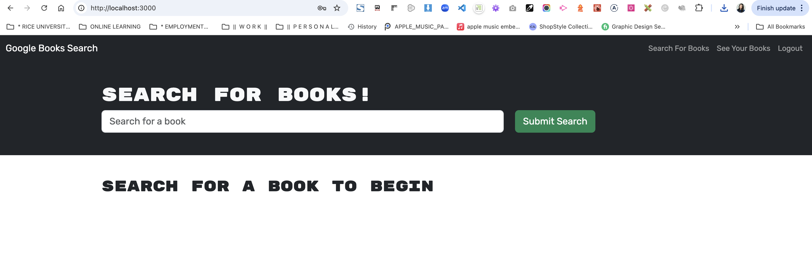
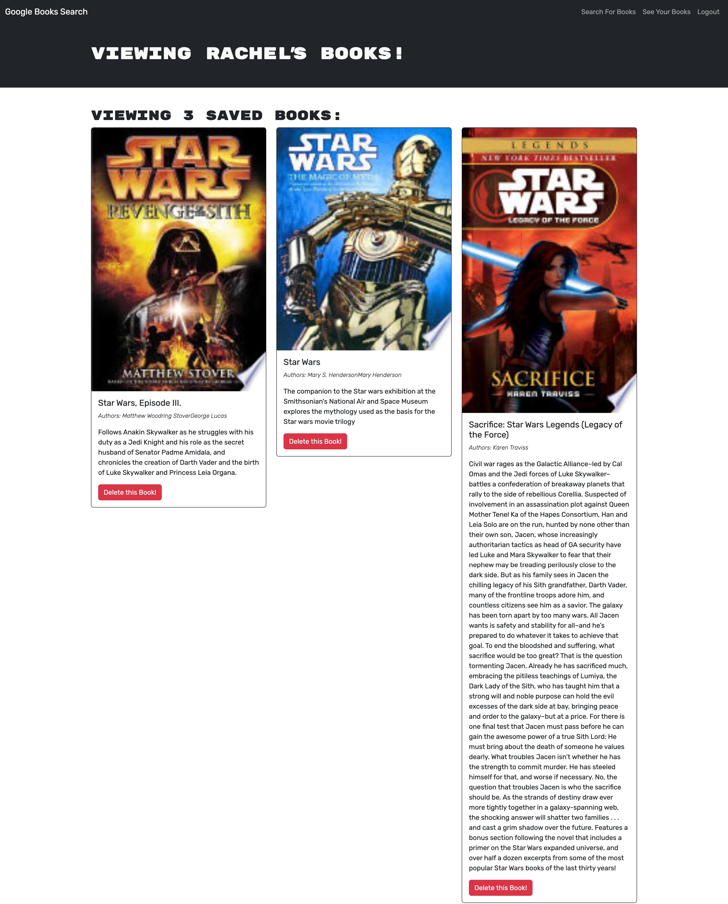

# MERN Challenge: Book Search Engine
# Module 21

## Table of Contents
- [Project Description](#project-description)
- [Technologies Used](#technologies-used)
- [Installation](#installation)
- [Usage](#usage)
- [Features](#features)
- [Project Structure](#project-structure)
- [License](#license)

---

## Project Description

The REACT_BOOKSTORE project is a full-stack application that enables users to explore, view, and manage a collection of books. Built using the MERN (MongoDB, Express.js, React, Node.js) stack, this project also incorporates GraphQL for API calls through Apollo Server on the backend. The goal is to create a seamless and interactive experience for book enthusiasts, allowing them to browse, search, and manage their reading preferences.

## Technologies Used

- **Frontend**: React, Vite
- **Backend**: Node.js, Express.js
- **GraphQL**: Apollo Server
- **Database**: MongoDB
- **Other Tools**: Nodemon, dotenv for environment variables

## Installation
See deployed site on Render:
<https://react-bookstore-s78p.onrender.com/>

### Prerequisites
Ensure you have the following installed on your machine:
- Node.js (v22.8.0 as required by this project)
- MongoDB

### Steps

1. Clone the repository:
   ```bash
   git clone <repository-url>

2. Navigate to the project directory
`cd REACT_BOOKSTORE`

3.  Install the dependencies
`npm install`

4.  Set up environment variables:
- Create a .env file in the root directory.
- Add your MongoDB URI and any other necessary environment variables:

`MONGODB_URI=<your-mongo-uri>
PORT=3001`

## Usage

Once the server is running, open your browser and go to http://localhost:3000 to view the application.





## GraphQL Playground
If you want to interact directly with the GraphQL API, navigate to http://localhost:3001/graphql (or as configured in your environment variables).

## Features

- Book Browsing: Users can view a list of books with detailed information.
- Search and Filter: Search for books by title, author, or genre.
- GraphQL Integration: Efficiently fetches data using GraphQL queries and mutations.
- User Management: Users can sign up, log in, and maintain a personal reading list.

## Project Structure
REACT_BOOKSTORE/
├── client/                  # Frontend code
│   ├── src/
│   │   ├── components/      # Reusable React components
│   │   ├── pages/           # Application pages (Home, Book Details, etc.)
│   │   ├── utils/           # Utility functions
│   └── vite.config.js       # Vite configuration
├── server/                  # Backend code
│   ├── models/              # Mongoose models for MongoDB
│   ├── schema/              # GraphQL typeDefs and resolvers
│   ├── server.js            # Main server file
│   └── .env                 # Environment variables
├── package.json             # Project dependencies and scripts
└── README.md                # Project documentation

## Credits

\*\* This project was accomplished with the help provided by the instructors and TAs of the Rice University Coding Bootcamp, including Instructor Darian Mendez, Mateo Wallace, Mark Alfano, Gerard Mennella

Starter code was used to begin this project, which can be found at:

-- React Bookstore Starter Code
<https://github.com/coding-boot-camp/solid-broccoli>


## License

- License Distributed under the MIT License. See LICENSE.txt for more information.